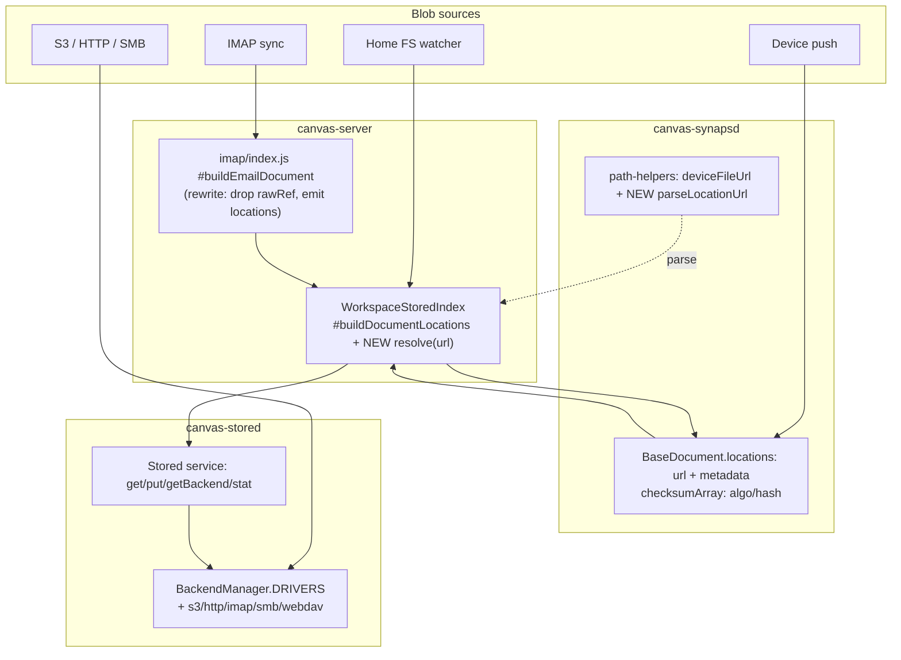

# Unified Storage URL Scheme — Design Spec

## Context

Canvas indexes blobs across heterogeneous backends (workspace home, device FS, S3, HTTP, IMAP, SMB, WebDAV). The data model already supports this: `BaseDocument.locations: [{url, metadata?}]` (schema v2.2) is the source of truth for *where* a blob lives, and `BaseDocument.checksumArray` (`<algo>/<hash>`) is the source of truth for *what* it is.

**The codebase already has a working location-URL convention.** Today, three forms are produced and consumed:

- `stored://<backend>/<key>` — built by `WorkspaceStoredIndex.#buildDocumentLocations` (backends `fs:home`, `fs:data:<abstraction>`); dispatched by the `Stored` service (`src/services/stored`).
- `file://{WORKSPACE_ROOT}/home/<path>` — built by `routes/workspaces/home.js:198` and `WorkspaceStoredIndex`; resolved by the WebDAV virtual-FS layers via `url.slice(7).replace('{WORKSPACE_ROOT}', ws.rootPath)` (the shared `localPath()` in `vfs-shared.js`, used by `TreeFS.js` and `VirtualNamedContextFS.js`).
- `file://<deviceId>/<path>` — device-local, built by `path-helpers.deviceFileUrl()`.

The real inconsistency is narrow: **Email bypasses `locations[]` entirely.** `src/core/workspace/services/imap/index.js:535-585` writes the raw message to `data/email/raw/<sha>.eml` and attachments to `data/email/attachments/<rawSha>/...`, recording them only in ad-hoc `data.rawRef = {backend, key, checksum}` and per-attachment `storageRef`. `emailDoc.locations` is never set, so emails are invisible to the unified resolver, dedup, and eviction paths.

**Goal:** lock down the *existing* `stored://` + `file://` grammar as the single scheme, bring Email onto it with an RFC-aligned on-disk layout, define remote backends (s3/http/imap/smb/webdav) and a single resolver. This is a design spec; the code changes it describes are a follow-up, executed per-repo.

### Decisions
1. **Scheme:** extend the existing `stored://` + `file://{WORKSPACE_ROOT}` + `file://<device>` conventions. **No `workspace://` scheme, no `cache/` authority** (not a real workspace dir). Remote sources become named `Stored` backends; the canonical fetch URL is always `stored://<backend>/<key>`. Native RFC URLs (e.g. `imap://…;UID=`, `s3://bucket/key`) may appear as **secondary provenance** entries in `locations[]`.
2. **Email storage:** route through a `Stored` data backend with an RFC-aligned layout `data/email/<account>/<folder>/<sha256>.eml` (RFC 5322 message bodies; `<account>` = `user@domain`, `<folder>` = URL-encoded IMAP path). Replaces both `data/email/raw/` and the generic `data/abstraction/email/`.
3. **Cross-repo:** the three affected repos (`canvas-synapsd`, `canvas-stored`, `canvas-server`) are submodules editable in one tree; changes are pushed per-repo. This is one design doc covering all three.

### Facts this spec relies on
- Checksums in `checksumArray` are `<algo>/<hash>` (sha256), **not** `sha256:<hex>`. The colon form is internal to `Stored` keys only.
- `rawRef` is **not** in Email's Zod schema (set at runtime via `.passthrough()`); only `attachments[].storageRef`/`url`/`checksum` are declared.
- IMAP sync lives in **canvas-server**, not synapsd.
- Home→`locations` is produced by `WorkspaceStoredIndex`, **not** webdav `server.js _handleHome` (which only serves raw FS).

---

## URL Grammar (canonical)

Every `locations[].url` matches one of:

| Scheme | Example | Resolves via | Notes |
|--------|---------|--------------|-------|
| `stored://<backend>/<key>` | `stored://fs:data:email/a@b.com/INBOX/9f3..eml` | `Stored.getBackend(backend).get(key)` | **Canonical fetchable form** for all managed blobs |
| `file://{WORKSPACE_ROOT}/home/<path>` | `file://{WORKSPACE_ROOT}/home/docs/x.pdf` | strip `file://`, sub `{WORKSPACE_ROOT}`→`ws.rootPath`, read FS | Existing WebDAV/home convention — unchanged |
| `file://<deviceId>/<path>` | `file://jdoe@host/$HOME/.bashrc` | device proxy (future) / local FS | Built by `deviceFileUrl()` |
| `imap://<account>/<folder>;UID=<n>` | `imap://a@b.com/INBOX;UID=4711` | provenance only (RFC 5092) | Secondary entry; not the fetch URL |
| `s3://`, `https://`, `smb://`, `webdav://` | `s3://bucket/key` | provenance, or fetch once registered as a backend | |

**Backend names** encode provider+account: `fs:home`, `fs:data:<abstraction>`, `s3:<account>`, `imap:<account>`, etc. (matches `WorkspaceStoredIndex.#buildLocation` derivation).

**Rules:** content checksums live only in `checksumArray`; per-location extras (size, mtime, etag, synced flag, provenance) live in `locations[].metadata`; one checksum → N `locations[]`.

---

## Shape of the change



**Email before → after:**
```
BEFORE  data.rawRef = {backend:'workspace', key:'data/email/raw/<sha>.eml', checksum:'sha256:<hex>'}
        attachments[].storageRef = {backend:'workspace', key:'data/email/attachments/<rawSha>/<sha>-<name>'}
        locations = []                       # email invisible to resolver/dedup

AFTER   locations = [
          {url:'stored://fs:data:email/<account>/<folder>/<sha>.eml', metadata:{size, synced:true}},
          {url:'imap://<account>/<folder>;UID=<n>', metadata:{provenance:true}}   # RFC 5092
        ]
        checksumArray = ['sha256/<hex>']
        attachments[] = {filename, contentType, size, checksum:'sha256/<hex>',
                         url:'stored://fs:data:email/<account>/<folder>/<sha>/<name>'}  # storageRef removed
```

---

## Files to Touch (cross-repo)

### canvas-synapsd (`src/services/synapsd/`)
- `src/utils/path-helpers.js` — **add** `parseLocationUrl(url)` → `{scheme, backend, key, query}` (WHATWG `new URL` + scheme conventions; handles `stored://`, `file://{WORKSPACE_ROOT}`, `file://<device>`, `imap://…;UID=`, `s3://`). Keep `deviceFileUrl()`. Do **not** add `workspaceUrl` (scheme rejected).
- `src/schemas/abstractions/Email.js:74-86` — drop `attachments[].storageRef`; keep `url` + `checksum`. No `rawRef` to remove (not in schema). Bump `DOCUMENT_SCHEMA_VERSION`.
- `src/schemas/abstractions/File.js:104-110` `resolveUri()` — stays a `{VAR}` expander; full URL→path resolution is the resolver's job (below). No new scheme handling needed.
- `src/schemas/BaseDocument.js` — **no change** (`locations`/`checksumArray` already present; v2.2).

### canvas-stored (`src/services/stored/`)
- `src/backends/BackendManager.js:6` — extend `DRIVERS` with `s3`, `http`, `imap`, `smb`, `webdav`.
- **New** `src/backends/{s3,http,imap}/index.js` — implement `StorageBackend` (`put/get/delete/stat/list`; `get(key,{stream})` like `file/index.js:48`). **Skeletons only** in the first pass.
- `src/index.js` — optional `getByUrl(url)` helper parsing `stored://<backend>/<key>` → `getBackend(backend).get(key)`. (`get/getBackend/stat/has` already exist.)

### canvas-server (`src/`)
- `src/core/workspace/services/imap/index.js:518-585` — rewrite `#persistBuffer`/`#buildEmailDocument`: persist via the email data backend at `data/email/<account>/<folder>/<sha>.eml` (account=`mailbox.user`, folder=URL-encoded `box.name`); set `emailDoc.locations` (canonical `stored://fs:data:email/…` + provenance `imap://…;UID=`); push `sha256/<hex>` to `checksumArray`; **delete** `data.rawRef`; rewrite attachments to `url` (stored://) + `checksum` only.
- `src/core/workspace/lib/WorkspaceStoredIndex.js:30-32,141-161` — allow an RFC-aligned email layout: `dataBackendRoot` for `email` → `path.join(dataPath, 'email')` (not `abstraction/email`); `ensureDataBackend('email')` registers `fs:data:email` at that root. **Add** public `resolve(url, {stream})` dispatching `stored://` (→ `Stored.getBackend`), `file://{WORKSPACE_ROOT}` (→ FS via `ws.rootPath`), `file://<device>` (→ proxy stub), using `parseLocationUrl`.
- `src/transports/routes/workspaces/home.js:198` + `src/transports/webdav/Virtual*FS.js` — **no change** (already correct `file://{WORKSPACE_ROOT}`).
- `src/core/workspace/lib/constants.js` — **no change** (no `cache` dir; email lives under existing `data`).
- No migration: all instances are dev/test (recreate DBs). Legacy `rawRef`/`storageRef` docs are simply abandoned.

---

## Resolver

Single entry point on `WorkspaceStoredIndex` (holds the `Stored` instance + workspace paths). `resolve(url, {stream})` → buffer/stream + stat:

| URL scheme | Dispatch |
|------------|----------|
| `stored://<backend>/<key>` | `this.#stored.getBackend(backend).get(key, {stream})` |
| `file://{WORKSPACE_ROOT}/<path>` | substitute `ws.rootPath`, `fs.readFile`/`createReadStream` |
| `file://<deviceId>/<path>` | local FS if current device else device-proxy stub |
| `imap://`, `s3://`, `http(s)://` | provenance-only unless a matching backend is registered, then route through `Stored` |

Reuses existing `Stored.get` semantics (`src/index.js:120` finds a synced location and streams).

---

## Out of Scope (first pass)
- Full s3/http/smb/webdav driver impl — interfaces/skeletons only.
- Device-proxy fetch for `file://<deviceId>` of a remote device.
- Cross-workspace URLs (deferred until a real use case).
- Frontend/REST surface — unchanged.

---

## Verification (when code lands)
1. **Email ingest:** sync an IMAP folder; assert `email.locations[0].url === 'stored://fs:data:email/<account>/<folder>/<sha>.eml'`, file exists at `<data>/email/<account>/<folder>/<sha>.eml`, a provenance `imap://…;UID=` entry exists, `data.rawRef` is gone, `checksumArray` has `sha256/<hex>`, attachments have `url`+`checksum` and no `storageRef`.
2. **Home:** drop a file into the WebDAV Home mount; `WorkspaceStoredIndex` emits a `File` doc with `file://{WORKSPACE_ROOT}/home/<rel>` + `stored://fs:home/<rel>` (existing behavior preserved — regression check).
3. **Resolver round-trip:** `WorkspaceStoredIndex.resolve(url)` returns stream + stat for `stored://`, `file://{WORKSPACE_ROOT}`, and (stub) `file://<device>`.
4. **Device:** `dotfile push` still yields `file://<uuid>/<path>` (no regression).
5. **Destroy/lifecycle:** wipe a doc's `fs:data` location → bytes gone + index entry deleted (locations emptied); wipe one of several locations → index kept, `locations[]` trimmed; RO `http` location → reference dropped, no remote call.

---

## Critical Files
- `src/services/synapsd/src/schemas/BaseDocument.js` (model ref — no change)
- `src/services/synapsd/src/schemas/abstractions/Email.js` (drop `storageRef`; `checksumFields: []`)
- `src/services/synapsd/src/utils/path-helpers.js` (add `parseLocationUrl`)
- `src/core/workspace/services/imap/index.js` (rewrite persist + emit `locations`)
- `src/core/workspace/lib/WorkspaceStoredIndex.js` (email layout + `resolve()`)
- `src/services/stored/src/backends/BackendManager.js` + `StorageBackend.js` (driver registry)

---

## Deletion & Lifecycle Semantics (agreed design — not yet implemented)

### Content-addressable identity
- **One document per checksum.** `checksumArray[0]` is the primary index key; a re-found blob (same bytes, different location/name) **updates** the existing doc's `locations`/`metadata` — never duplicates.
- The checksum source is per-abstraction (`indexOptions.checksumFields`): blob/whole-data for **file**/**email** (`checksumFields: []` → raw `.eml` blob hash set by the ingest layer); semantic fields elsewhere (**Note** = `data.subject`+`data.content`, **Tab/Website** = `data.url`). Either way it stays the single primary key.
- For email, header identity (messageId/from/…) is NOT the content key — deferred to a future contacts/identity index.
- Consequence: there is no cross-document dedup refcount to maintain — a doc's `locations[]` IS its complete physical reference set.

### Two reference dimensions
1. **`locations[]`** — physical copies across backends (fs/s3/imap/http). Trimmed by *Destroy*.
2. **context links** — tree memberships (incoming, `/work/...`). Trimmed by *Remove* (unlink). Separate bitmap, not `locations`.

### Backend capability (drives Destroy)
Add `capabilities`/`canDelete` to `StorageBackend`:
| Backend | Delete | On Destroy of that location |
|---------|--------|-----------------------------|
| `file` (fs:home, fs:data) | RW | `delete(key)` — removes bytes |
| `s3` | RW | real delete |
| `imap` | RW (needs EXPUNGE) | STORE `\Deleted` + EXPUNGE by UID |
| `http`/`https` | RO | drop the location entry only — no remote call |

### Operations
| UI | Primitive | Notes |
|----|-----------|-------|
| **Remove** (from tree) | `unlink(id, treeSelector)` | non-destructive; default action in curated contexts |
| **Delete** (from index) | `db.delete(id)` | **warn**, especially once Canvas is the primary index |
| **Destroy** (from backend[s]) | per-location, capability-driven | user ticks which backends to wipe |

```
Destroy(doc):
  list locations (backend, key, capability); user ticks which to wipe
  for each ticked:
     if backend.canDelete: await backend.delete(key)   # fs / s3 / imap
     # RO (http): no remote call
     remove entry from doc.locations
  if doc.locations.length == 0:
     warn if still linked in N contexts → "also removes from N trees"
     db.delete(doc)          # cascade — no contentless cards
  else:
     persist trimmed doc.locations[]
```

### Tree policy
- **`.incoming` = read-only mirror.** Source of truth is the backend (mirrored per settings: fetch count, `initialSyncDays`). Context menu + content area expose **Resync only** — no Remove/Delete/Destroy. Resync re-pulls + purges orphans (`#purgeOrphanedPaths`); IMAP needs EXPUNGE/UID-vanished handling to prune server-side deletes locally. Resync-purge of an orphan = Destroy of its local `stored://` location (same machinery).
- **Curated context trees = decoupled, no resync.** Hand-built model; link only what you care about. Destroy/Delete allowed here behind the flow above.

### Implementation status
**Architecture decision:** all storage backends live in `stored` (fs/s3/http/imap/…; future mongodb/redis, stored-queries to DB/API). `synapsd` = index only. `workspace` is storage-agnostic. IMAP ingest currently in `canvas-server` ImapService **moves to a stored imap backend** — Phase 1 below builds the read/delete half; Phase 2 (later) moves connect/poll/doc-build via an event-driven indexer (mirrors `FileBackend → WorkspaceStoredIndex`).

**Done:**
- `StorageBackend.capabilities`/`canDelete` (default RW; `HttpBackend` = read-only). `FileBackend.delete()` already real.
- `Stored.deleteByUrl(url)` — capability-checked blob delete.
- `WorkspaceStoredIndex.destroy(doc, {urls})` + `describeLocations(doc)` (per-location deletable flag for the picker); cascade `db.delete` when `locations[]` emptied; lazy backend registration shared with `resolve()`. `Workspace.destroyDocument`/`describeDocumentLocations` passthroughs.
- **IMAP backend Phase 1** (`stored/backends/imap`): real `get` (fetch raw by UID) + `delete` (STORE `\Deleted` + EXPUNGE by UID, key `<folder>;UID=<n>`), caps `{read, delete, write:false}`. `destroy` routes imap:// via lazy `imap:<account>` registration; creds bridged from `config/imap.json` by `Workspace.#getImapConfig` (injected `getImapConfig`). No creds → reference-drop only.

**Pending:**
- **IMAP Phase 2:** move connect/poll/watch + `#buildEmailDocument` out of `ImapService` into the stored backend + a workspace indexer; delete `ImapService`. Do after prod ingest is proven stable.
- `s3` real `delete()` (skeleton today).
- resync-purge reusing `destroy` for orphaned incoming blobs.
- UI: per-tree context-menu gating (incoming = Resync only); Destroy backend-picker dialog (uses `describeDocumentLocations`); Delete warning.
